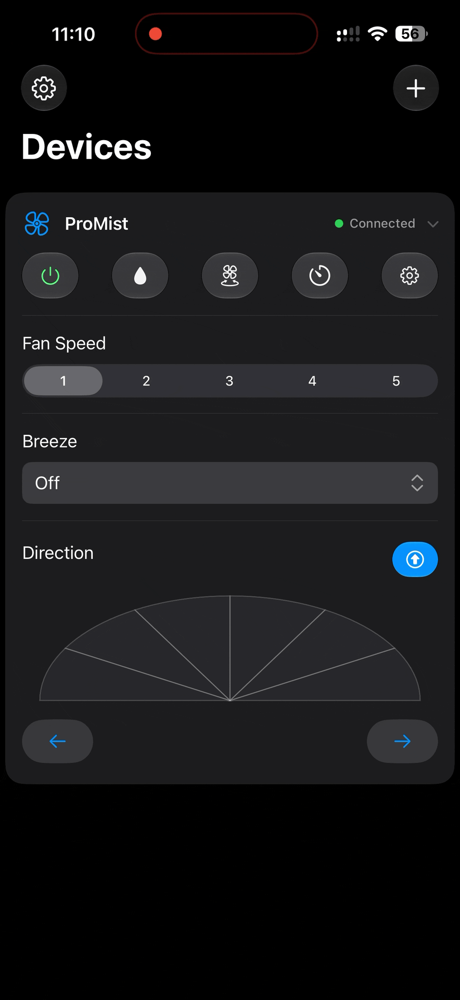
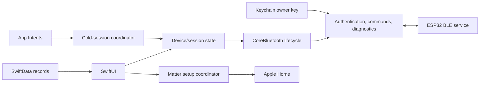
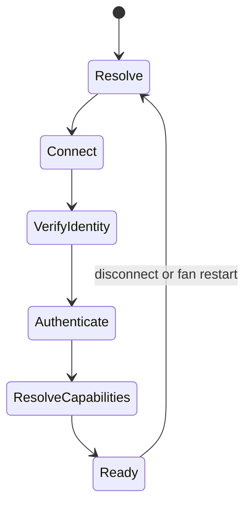
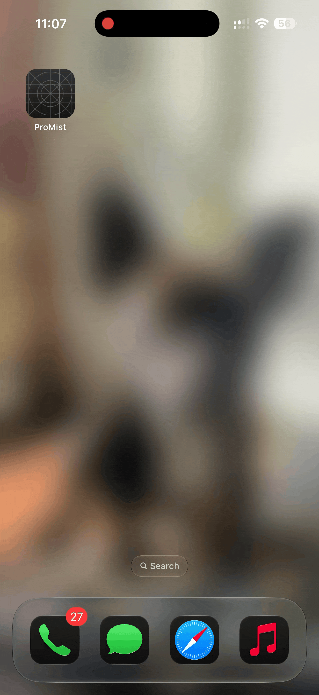

# ProMist iPhone application

The ProMist app is the nearby setup, control, and diagnostic client for the
retrofit. It exposes the full device model over the proprietary BLE service and
hands standard fan controls to Apple Home through Matter.

The application target supports iPhone and iPhone Simulator with an iOS 17.6
deployment target. It does not currently build as a native iPad, macOS, or
visionOS app. The project uses Swift 6 and requires Xcode 26.5 or later for the
checked-in build and test setup.

## User-facing features

- Discover, enroll, authenticate, reconnect to, and forget a ProMist fan.
- Control power, five fan levels, mist, oscillation width, fixed direction, and
  built-in or custom breeze profiles.
- Edit and transfer three custom breeze slots.
- Rename the fan, inspect structured diagnostics, clear faults, and reset
  connection information.
- Retrieve the authenticated Matter setup payload and start Apple's
  commissioning flow.
- Associate the saved fan with its Apple Home accessory.
- Run mist, breeze, oscillation, direction, and centering actions through Siri
  and Shortcuts.

### Feature walkthroughs

| Custom breeze editor | Apple Home setup |
| --- | --- |
|  |  |
| Create a timed fan-speed curve, name it, transfer it to the fan, and select it from the device controls. | Hand the authenticated Matter setup payload to Apple's commissioning flow, name the accessory, and reconnect to it. |

## Design

The app uses SwiftUI and Observation for presentation, SwiftData for saved fan
records, CoreBluetooth for the proprietary service, Keychain for owner keys,
HomeKit/Matter setup APIs for Apple Home, and App Intents for Siri and
Shortcuts. CoreBluetooth state and delegate callbacks stay on the main actor.



The code is grouped by responsibility rather than by screen:

- **CoreBluetooth lifecycle and discovery** — one central owns scanning,
  retrieval, connection, GATT discovery, notifications, and raw delegate
  events. A separate policy models known-device attempts, refresh generations,
  identity checks, reconnects, and stale callback rejection.
- **Connection and authentication** — enrollment, challenge/response,
  timeouts, recovery, and the ready-session state machine are isolated from UI
  concerns. The full firmware device ID is checked before a saved credential is
  used.
- **Command transactions** — typed requests receive nonzero request IDs and
  complete only when a matching response arrives. Duplicate, late, malformed,
  timed-out, cancelled, and disconnected transactions have deterministic
  outcomes.
- **Diagnostics and custom data** — diagnostic pages validate request IDs and
  contiguous sequences, retry bounded gaps, and preserve partial results.
  Custom breeze transfers use separate acknowledgment tracking.
- **Device state** — observable session state and capability resolution turn
  the GATT profile plus the firmware feature manifest into controls the UI may
  safely present. SwiftUI never receives `CBCharacteristic` objects.
- **Apple integration** — Matter commissioning, Home accessory association,
  App Intent entities, and cold-start control are kept separate from the BLE
  delegate implementation.

The firmware's state notification, not a button tap or successful write, is the
source used for displayed appliance state. This matters when a physical button,
the RF remote, Apple Home, or another event changes the fan at the same time as
the app.

## BLE sessions

A known-device session follows this sequence:



The saved CoreBluetooth peripheral identifier is only a shortcut for finding a
fan. After connection, the app reads the complete 64-bit identity and rejects a
mismatch. It then enrolls during a physical provisioning window or proves the
saved 256-bit Keychain credential with fresh nonces.

Disconnecting destroys the authenticated session and pending request sequence.
Reconnect waits for identity, authentication, capability resolution, and an
initial firmware state before returning to ready.

Transport support and device capability are evaluated separately. The common
command characteristic can carry a mist command, for example, but the UI shows
mist only when the device-information manifest also declares mister hardware.
Malformed mandatory characteristics fail the session; missing optional
characteristics hide only the affected feature.

Enrollment deliberately spans the physical appliance and the iPhone app. The
fan must first be placed in its time-limited enrollment mode; the app can then
discover it, establish ownership, and load its authoritative state.

| Open enrollment on the fan | Enroll from the iPhone app |
| --- | --- |
|  |  |

## Matter, Apple Home, Siri, and Shortcuts

After proprietary authentication, the app requests that fan's Matter onboarding
payload. It releases the proprietary BLE connection, lets Apple's setup flow
commission the device, and then records the stable Home/accessory association.
Room and display names are metadata, not identity.

Matter exposes standard fan power, percentage, and rocking behavior. Mist,
breeze profiles, fixed positions, diagnostics, naming, and proprietary owner
management remain on the first-party BLE service.

App Intents use the same app-owned control service as the foreground UI. A cold
intent resolves the saved device, requires its Keychain key, and waits for
event-driven discovery and authentication before sending a correlated command.
Concurrent intents share connection establishment; they do not create a second
CoreBluetooth stack or poll a SwiftUI scene.

## Persistence and security

`KnownFan` records the device identity, user-facing metadata, peripheral hint,
and Apple Home association in SwiftData. Owner credentials are stored only in
device-specific Keychain items and are not backed up to another phone.

Local removal deletes and verifies the Keychain item before deleting the
SwiftData record. Matter fabric membership and Apple Home association remain
separate from proprietary BLE ownership. See the root [security policy](../SECURITY.md)
for enrollment, recovery, and development-build limitations.

## Project organization

```text
ProMist/
├── ProMist/
│   ├── Models/              # Device, protocol, capability, and intent models
│   ├── Services/            # BLE, security, transactions, Apple integration
│   └── Views/               # SwiftUI screens and controls
├── ProMistTests/            # XCTest and Swift Testing coverage
└── ProMistUITests/          # Deterministic UI smoke coverage
```

## Build and test

Open `ProMist/ProMist.xcodeproj` from the repository root and use the shared
`ProMist` scheme.

### Apple signing prerequisites

A physical-device build requires an Apple development team whose program
membership supports the HomeKit and Matter capabilities. Before running the
app on an iPhone:

1. In Xcode, open the `ProMist` target's **Signing & Capabilities** pane, enable
   automatic signing, and select a valid development team.
2. Sign in to [Certificates, Identifiers & Profiles](https://developer.apple.com/account/resources/identifiers/list)
   on the Apple Developer website and register or edit an explicit App ID for
   the bundle identifier `com.demo.ProMist`.
3. Enable the **HomeKit** and **Matter Allow Setup Payload** capabilities for
   that App ID, then save the changes.
4. Return to Xcode and refresh signing so it can create or download a
   provisioning profile containing both entitlements.

The bundle identifier is case-sensitive and must remain exactly
`com.demo.ProMist`. Selecting a team without registering that App ID and its
capabilities results in a missing-profile or unsupported-entitlement build
error. Bluetooth and Home permissions are also required when the signed app
runs on the iPhone.

Run the full scheme on an installed iPhone simulator:

```sh
destination="$(./scripts/select-ios-simulator.sh)"
xcodebuild test \
  -project ProMist/ProMist.xcodeproj \
  -scheme ProMist \
  -destination "$destination" \
  -derivedDataPath /tmp/ProMistDerivedData \
  -resultBundlePath /tmp/ProMist.xcresult \
  CODE_SIGNING_ALLOWED=NO CODE_SIGNING_REQUIRED=NO
```

The project includes XCTest, Swift Testing, and UI coverage for protocol
parsing, authentication, identity and reconnect policy, command correlation,
timeouts, capability resolution, diagnostics, Matter handoff, local data
deletion, cold App Intent sessions, and stable feature visibility.

A fresh Xcode 26.6 run on an iOS 26.5 simulator executed 105 XCTest cases,
4 Swift Testing cases, and 5 UI tests (114 total) with no failures.

Simulator tests do not exercise the Bluetooth radio, encrypted enrollment,
background reconnects, Apple Home permissions, Matter commissioning, or the
physical appliance. Those flows have been verified with a signed build on an
iPhone and the installed ESP-IDF controller.

[Back to the project overview](../README.md)
