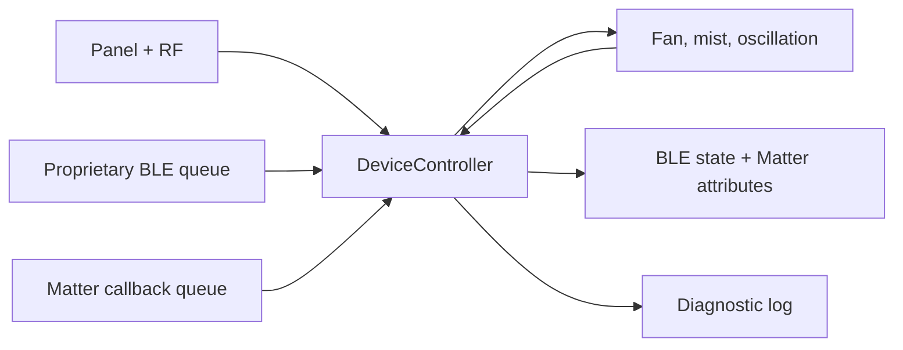

# ProMist ESP-IDF firmware

This is the supported firmware for the ProMist retrofit. It is a C++17
application built with ESP-IDF 5.5.5, FreeRTOS, ESP-IDF NimBLE, esp-matter
1.6.0, native ESP32 drivers, and NVS. The lockfile and component manifest pin
those versions; there is no Arduino runtime or alternate firmware path.

The development target is the classic 4 MB ESP32 installed in the appliance.
The current firmware has been built, flashed, and exercised on that hardware,
including the panel, RF remote, motor and tach, mister, oscillation and Hall
sensor, proprietary BLE, Matter commissioning, and Apple Home.

## Responsibilities

| Area | Firmware behavior |
| --- | --- |
| Fan | 25 kHz PWM, tach capture and qualification, five logical levels, startup and fault policy |
| Oscillation | Half-step drive, Hall homing, persisted position reference, learned travel envelope, fixed positions and width modes |
| Mister | Active-high output with safe-off initialization; no flow or current feedback |
| Physical panel | AP1651 button scan, LEDs, display animations, status and recovery gestures |
| RF remote | Active-low any-edge capture, glitch filtering, pulse classification, and known 40-symbol fingerprints |
| Proprietary BLE | Discovery metadata, ownership, commands, state, naming, Matter setup payload, breeze slots, and diagnostics |
| Matter | Standard fan power, percentage, fan mode, and left/right rocking through esp-matter |

The pin levels, PWM polarity, AP1651 timing, RF thresholds, Hall behavior, and
oscillation limits are specific to the appliance that was reverse engineered.
Do not assume another product or hardware revision uses the same interface.

## Control and execution model

`app_main()` initializes runtime NVS, the GPIO ISR service, stable device
identity, persistent stores, safe hardware outputs, the proprietary GATT
service, and the Matter endpoint. It then starts one application task pinned to
CPU 1 with priority 5 and a 12,288-byte stack.

`DeviceController` is the shared logical state machine. BLE, Matter, panel, RF,
timers, and hardware feedback submit typed commands or observations to it.
Hardware drivers receive validated targets, and updated snapshots return to BLE,
Matter, the panel display, and diagnostics. Radio callbacks do not write GPIO or
move an actuator directly.



NimBLE and Matter/Wi-Fi tasks belong to ESP-IDF and CHIP. Their callbacks copy
bounded events into queues for the application task. Tach and RF interrupt
handlers use fixed storage and ISR-safe critical sections; they do not allocate,
log, persist data, or apply policy. Monotonic deadlines use
`esp_timer_get_time()`.

## Proprietary BLE service

The service uses a versioned, little-endian wire format. Required
characteristics cover device information, authentication, commands, responses,
and state. Optional characteristics add diagnostics, friendly naming, Matter
onboarding, provisioning status, and three custom breeze slots.

A physical FAN hold opens a bounded enrollment window. Firmware creates a
random 256-bit owner key, stores it in NVS, and returns it once over an encrypted
BLE link. Later connections authenticate with fresh client/device nonces and
HMAC-SHA-256 bound to the full device ID. Writes that change state or expose
private data require authentication.

The Matter and proprietary services share one NimBLE host configured for two
links. This supports commissioning coexistence but not two proprietary owners:
only one connection can hold the authenticated app-control session. Matter
fabric membership never grants that owner key.

Each command includes an origin-scoped request ID. The controller rejects stale
or duplicate IDs, and the response echoes the ID for client correlation. A
separate state notification reports the resulting fan state.

## Matter

`EspMatterFanEndpoint` creates Fan endpoint 1 using Matter device type `0x002B`,
revision 4. The Fan Control cluster supports Off/Low/Medium/High mode, percent
setting/current, and left/right rocking. Incoming attribute writes enter an
eight-item queue and are converted to `DeviceCommand` values by
`MatterFanAdapter`.

Controller snapshots update Matter attributes under the CHIP stack lock. The
endpoint is populated before it becomes externally visible. esp-matter stores
Wi-Fi, fabric, operational identity, and access-control data in its standard
runtime NVS storage.

## Physical controls and recovery

The panel and RF remote use the same controller command path as BLE and Matter,
so they continue working when network services are unavailable.

- Hold FAN for five seconds while unowned and powered off to open BLE
  enrollment for 60 seconds.
- Hold MIST for ten seconds while powered off to restart without erasing saved
  state.
- Hold OSCILLATION for ten seconds while powered off to erase runtime settings,
  proprietary ownership, BLE bonds, Matter fabrics, Wi-Fi credentials,
  diagnostics, names, breeze profiles, and learned position data.

<p align="center">
  
  <br>
  <em>The connectivity-reset gesture and its confirmation on the retained panel.</em>
</p>

Oscillation steps are checked against the learned safe envelope. Invalid or
out-of-range persisted position data remains untrusted and routes through the
normal homing path. The mister is intentionally open-loop because the retained
hardware exposes no feedback signal.

## Persistence and diagnostics

Small stores cover the friendly name, owner credential, custom breeze profiles,
fault history, controller settings, and oscillation position/reference data.
NVS writes occur from application context, not radio callbacks or interrupts.
The whole-device recovery gesture clears both project and Matter runtime state.

Diagnostics use a fixed numeric event catalog and a 64-record ring. Severity,
component, and payload shape are validated before an event is accepted. The
ring is saved in alternating versioned NVS slots with generation and CRC checks,
then paged to an authenticated app client. Secret values are excluded from the
catalog.

## Hardware abstraction

Hardware-independent domain code does not import GPIO, NimBLE, FreeRTOS, or
esp-matter and is compiled directly by the host tests. ESP-IDF adapters own
GPIO/LEDC, NVS handles, the GATT service, and the Matter endpoint. This split
keeps protocol, state, safety, display, persistence, and Matter conversion rules
testable without pretending that a host test validates real electrical behavior.

## Build profiles

The development wrapper creates an isolated generated configuration and build
under `ProMistIDF/.builds/`, resolves locked managed components, and applies the
reviewed esp-matter 1.6.0 BLE identity patch only to its expected source state:

```sh
PROMIST_IDF_PATH=/path/to/esp-idf-v5.5.5 \
  ./scripts/build-firmware-dev.sh
```

The installed 4 MB profile uses wired updates and has no OTA partition. Secure
Boot, flash encryption, and NVS encryption are disabled for development.

The production build is a future 8 MB hardware template. It requires an ignored
operator-supplied Secure Boot signing key and validates signed A/B partitions,
release flash encryption, encrypted NVS, rollback/anti-rollback, and LE Secure
Connections before building:

```sh
PROMIST_IDF_PATH=/path/to/esp-idf-v5.5.5 \
  ./scripts/build-firmware-production.sh
```

That command does not flash, burn eFuses, install production Matter
credentials, or implement an OTA downloader/writer and boot confirmation path.

## Flash and monitor

Confirm the classic ESP32 target, 4 MB development profile, exact serial port,
isolated power setup, mechanical clearance, and safe motor/pump/stepper outputs
before attaching the appliance:

```sh
. /path/to/esp-idf-v5.5.5/export.sh
idf.py -C ProMistIDF \
  -B ProMistIDF/.builds/build-development \
  -p /dev/cu.usbserial-0001 flash monitor
```

`erase-flash` removes firmware, owner data, Wi-Fi credentials, Matter fabrics,
names, diagnostics, breeze profiles, and learned calibration. It is not a
routine commissioning or recovery step.

## Tests and physical validation

From the repository root:

```sh
./scripts/test-host.sh
./scripts/test-host-sanitized.sh
./scripts/check-repo-hygiene.sh
```

The portable C++17 suites cover controller transitions, request sequencing,
BLE encoding and decoding, one-owner session policy, Matter conversion,
diagnostic validation and paging, custom breeze profiles, display behavior,
safety limits, and OTA admission/boot-decision policy. The sanitizer wrapper
runs the same tests under AddressSanitizer and UndefinedBehaviorSanitizer.

The installed appliance has separately passed cold boot and persistence, fan
and tach faults, Hall homing and travel limits, mist, every panel/RF control,
BLE enrollment/authentication/reconnect, Matter commissioning and
recommissioning, Apple Home synchronization, custom breeze slots, diagnostics,
and simultaneous local/BLE/Matter operation. Repeat physical validation after
changes to hardware, drivers, radio behavior, persistence, security, or
actuator policy.

[Back to the project overview](../README.md) · [Security policy](../SECURITY.md)
