# Shark FlexBreeze Pro Mist — ESP32, Matter, and Apple Home retrofit

The Shark FlexBreeze Pro Mist is a portable oscillating fan with a misting
system, onboard controls, and an RF remote. ProMist replaces its failed main
controller. SharkNinja replaced the original fan under warranty, and the failed
unit became the basis for a retrofit rather than e-waste.

The new controller keeps the appliance's motor, mister, oscillation mechanism,
panel, display, RF remote, wiring, power supply, and enclosure. An ESP32 takes
the place of the original controller and adds an authenticated BLE service,
Matter, Apple Home, and a native iPhone app. The original buttons and remote
continue to work without a phone or network connection.

The current C++17 ESP-IDF and esp-matter firmware has been built, flashed, and
tested on the installed appliance. Physical controls, BLE, Matter commissioning,
Apple Home control, recovery, diagnostics, and state updates between control
surfaces all work on the real fan.

## What it does

- Preserves the original panel, LEDs, display, and GEM RF remote.
- Controls five fan levels with tach-based startup, low-speed, no-turn, and
  overspeed checks.
- Runs the retained mister pump, with safe-off startup behavior.
- Homes and positions the oscillation mechanism using its Hall sensor and
  learned travel limits.
- Provides built-in and editable breeze profiles.
- Exposes local control, naming, setup, and diagnostics over BLE.
- Uses a physically opened enrollment window and a device-specific owner key
  for proprietary BLE access.
- Exposes standard fan power, speed, and rocking through Matter and Apple Home.
- Supports Siri and Shortcuts through App Intents for ProMist features that do
  not map to standard Matter fan controls.
- Runs as a SwiftUI app on iPhone with an iOS 17.6 deployment target.

## Hardware prototype

This controller was assembled from parts on hand and sized to fit the original
controller space. A classic 4 MB ESP32 development module handles logic and
radio services. Discrete interface and load-control components connect its
3.3 V signals to the retained 5 V and 12 V appliance circuits.

| Component side | Wiring side |
| --- | --- |
| 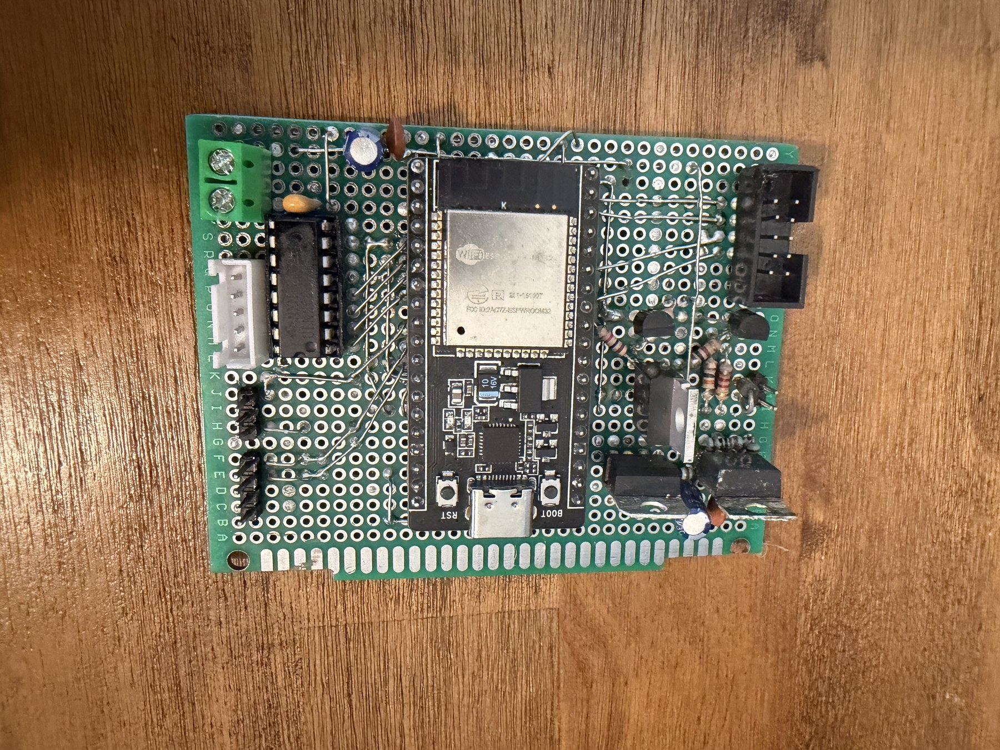 | 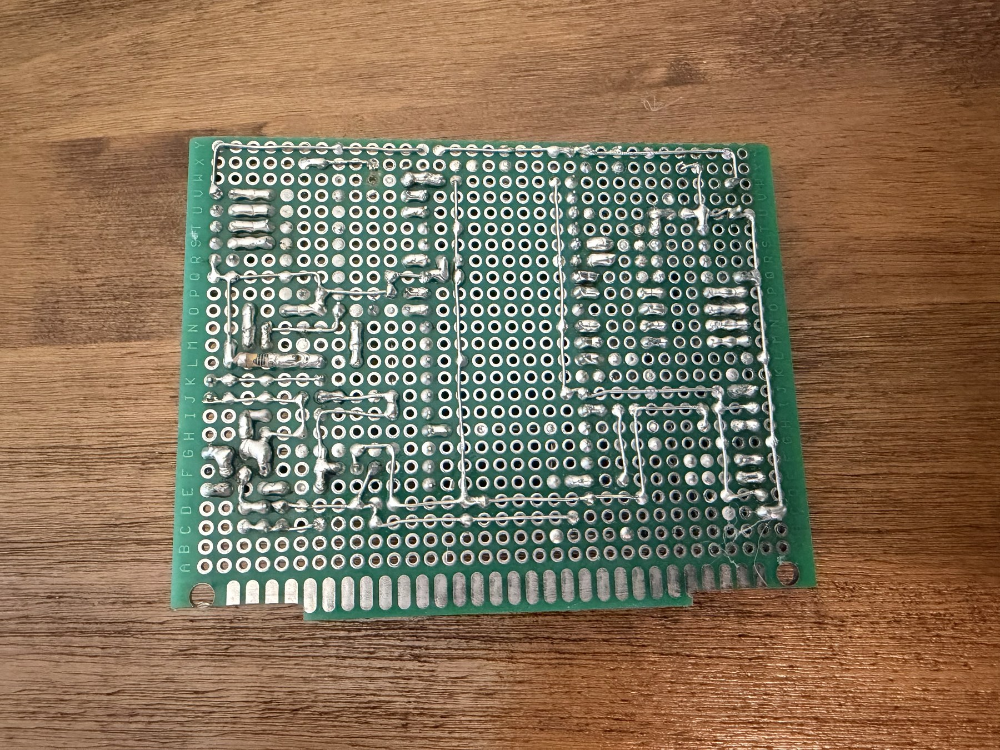 |
| The installed-appliance prototype, removed for inspection. The ESP32 module and retained-hardware connectors are visible. | The hand-wired underside kept signals accessible while the original interfaces were being measured and tested. |

| Interface detail | Top view |
| --- | --- |
| 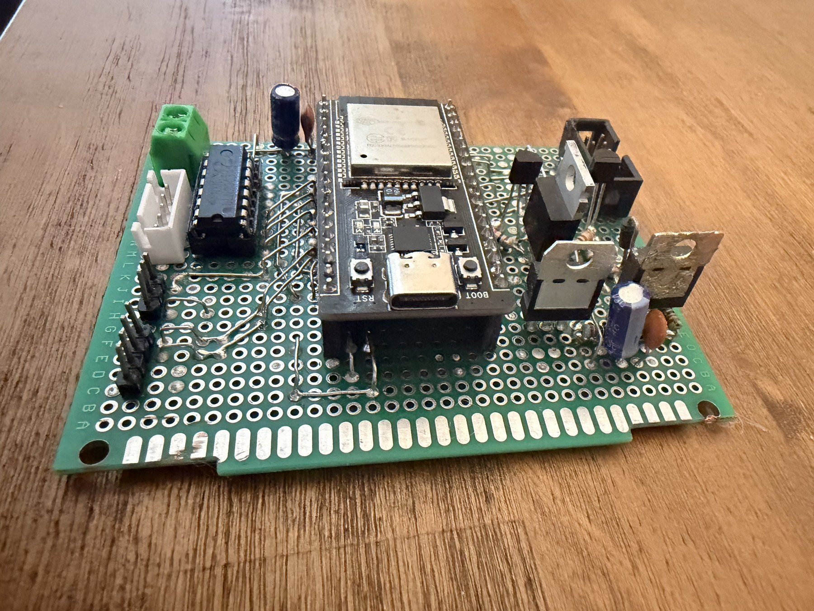 | 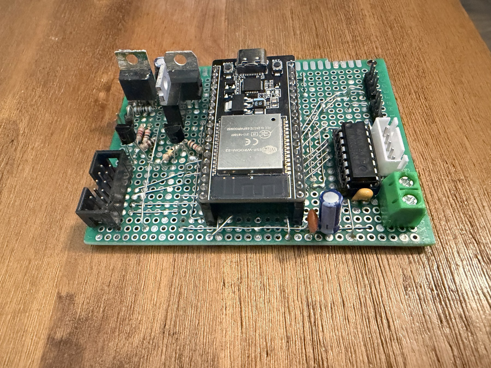 |
| The socketed ESP32 and discrete 3.3 V-to-appliance interface circuitry. | The board layout, retained-hardware headers, and load-control components. |

The ESP32 module's USB-C connector is available through the original rear cover
for wired firmware updates without reopening the controller compartment.

<p align="center">
  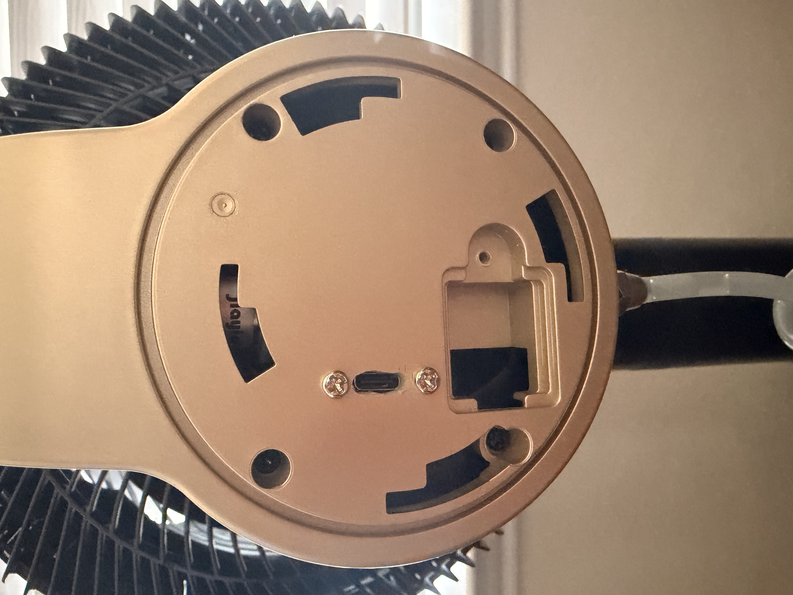
</p>

The original fan motor includes its drive electronics and tach output. The
retrofit also reuses the stepper-driven oscillation assembly, Hall reference
sensor, AP1651 panel board, RF receiver, mister hardware, harnesses, and power
system. The mister is open-loop because the retained circuit has no flow or
current feedback.

### Retained appliance components

| Fan assembly | Oscillation drive |
| --- | --- |
| 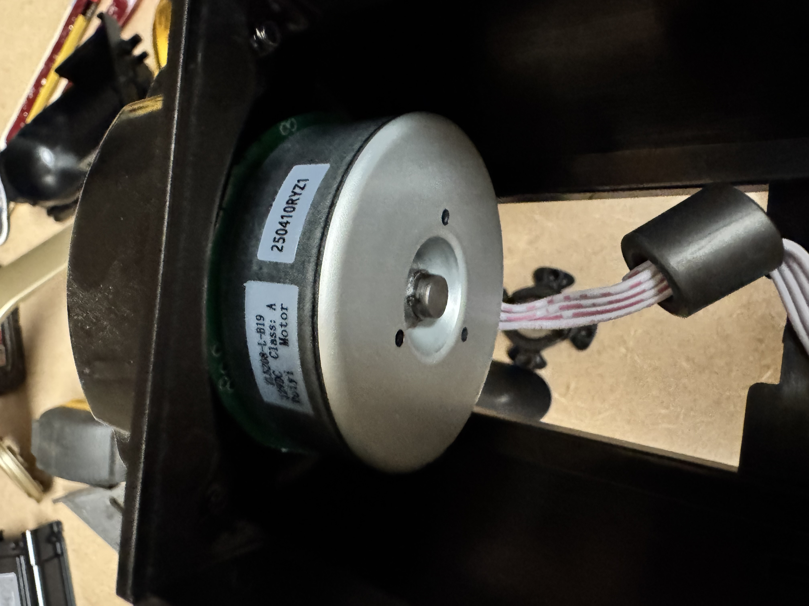 | 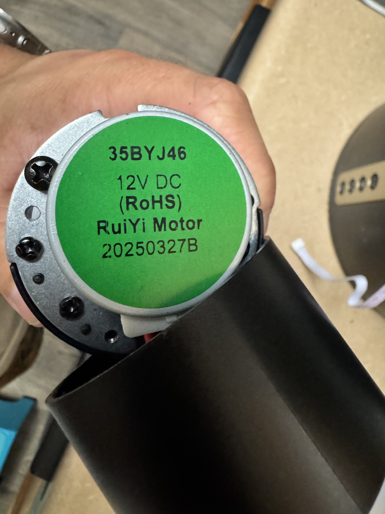 |
| The original fan motor, integrated drive electronics, and tach harness. | The original 12 V oscillation motor used for homing and position control. |

| Mister pump | Panel and RF board |
| --- | --- |
| 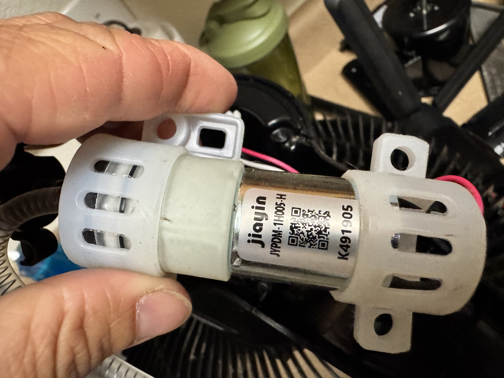 | 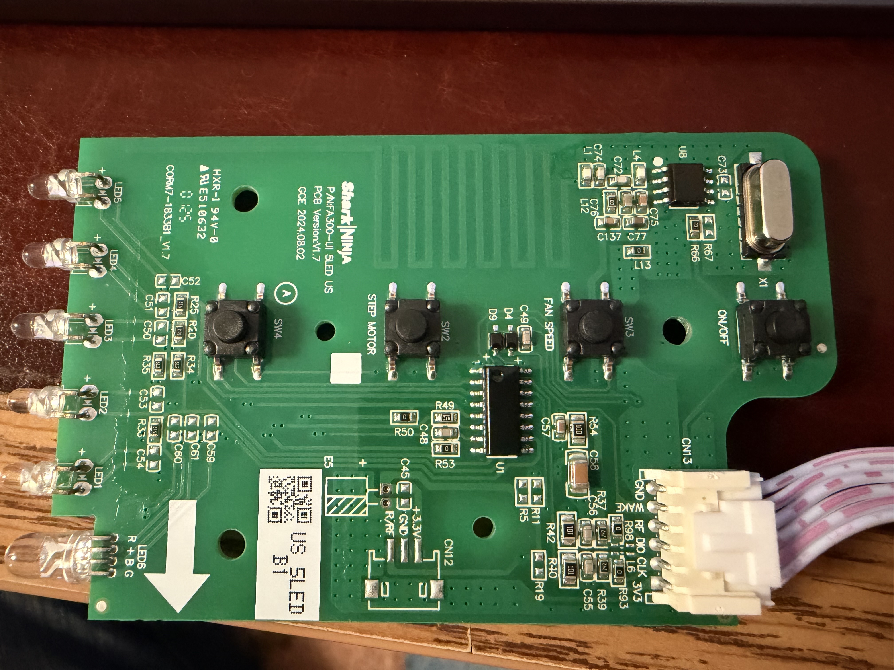 |
| The retained mister pump and its original mechanical mounting. | The original button, LED, display, and RF board, including its printed antenna. |

### Prototype wiring references

These diagrams document the hand-wired prototype and the connections used
while reverse engineering the appliance. Select either image to inspect the
full-resolution version.

| Breadboard-style wiring map | Electrical schematic |
| --- | --- |
| [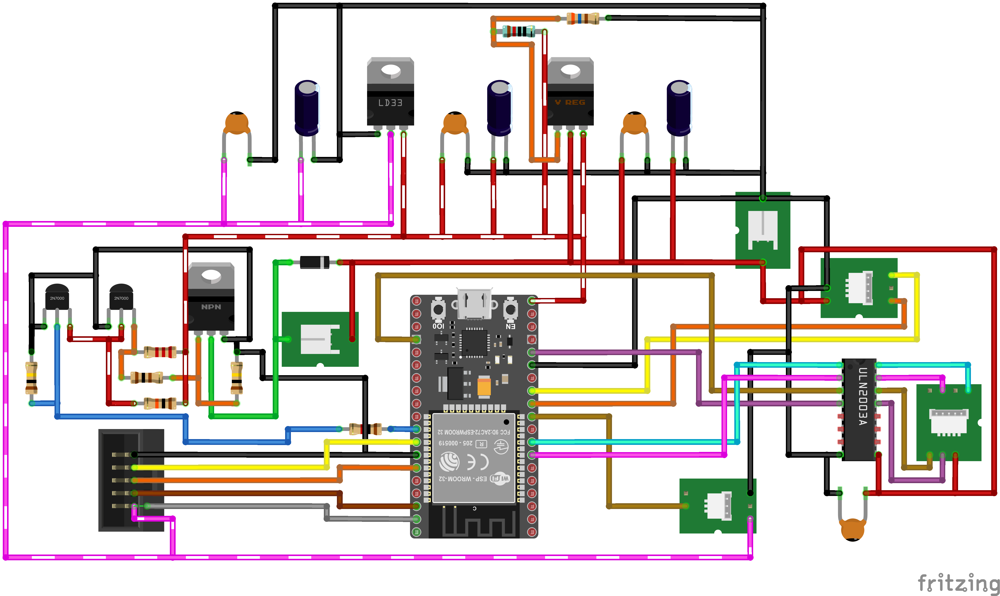](assets/hardware/breadboard-wiring.png) | [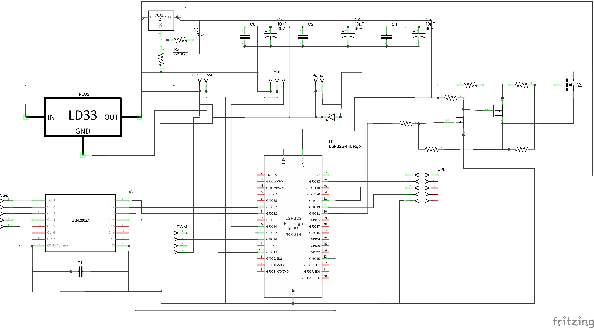](assets/hardware/electrical-schematic.png) |

This remains a development prototype, not a production controller. A later
revision would need an integrated power design, a larger-flash module, a custom
PCB, and assembly-level electrical, thermal, battery, fault, and EMC validation.

## System architecture

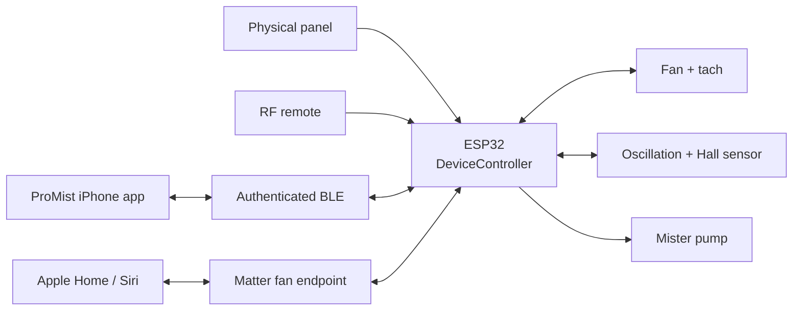

`DeviceController` holds the fan's shared logical state. Panel presses, RF
commands, BLE operations, and Matter attribute writes all become the same typed
commands before they reach the hardware. Feedback from the fan and oscillation
controllers returns through the same model, which then publishes updated state
to BLE and Matter.

Callbacks from NimBLE and Matter place bounded work on queues. The application
task applies commands, drives hardware, writes persistent data, and records
diagnostics. This keeps radio callbacks and interrupts from becoming alternate
paths to the actuators.

## Why it is interesting

The hard part is not merely making the fan respond to a phone. The original
controls, a BLE client, Matter controllers, and physical hardware all need to
agree on what the fan is doing.

That required reverse engineering the appliance's panel bus, RF pulse stream,
fan PWM and tach behavior, Hall-based oscillation travel, mister driver, and
electrical interfaces. The replacement electronics had to preserve familiar
local behavior while remaining responsive when Bluetooth, Wi-Fi, or Apple Home
was unavailable.

The BLE service adds a separate owner model for controls that Matter does not
cover. Enrollment requires physical access, the firmware generates a 256-bit
credential, and later connections prove it with fresh nonces and HMAC-SHA-256.
Matter fabrics remain independent from that credential.

Moving the prototype to ESP-IDF made FreeRTOS execution, GPIO and timing,
NimBLE sharing, NVS failures, Matter startup, and watchdog behavior visible in
one platform. The current firmware has no Arduino compatibility layer.

## Verification and current status

| Area | Status |
| --- | --- |
| Physical panel and RF controls | Verified on the appliance |
| Fan, tach, oscillation, Hall, and mist | Verified on the appliance |
| Proprietary BLE control and recovery | Verified on the appliance |
| Matter commissioning and Apple Home | Verified on the appliance |
| Cross-surface state synchronization | Verified on the appliance |
| Portable firmware host tests | Passing |
| ASan and UBSan host runs | Passing |
| iOS unit and UI suites | Passing |
| ESP-IDF development build | Passing |

Physical testing covered cold boot and persistence, all fan levels, tach and
fault recovery, homing and travel limits, panel/display behavior, RF decoding,
BLE ownership and reconnects, Matter removal and recommissioning, custom breeze
slots, diagnostic persistence, and simultaneous use of local and network
controls.

The installed board uses the 4 MB development profile and wired updates. The
repository includes a build-checked 8 MB production configuration with signed
A/B partitions, Secure Boot, flash encryption, and encrypted NVS settings, but
it does not implement an OTA download/install path or provision production
keys, eFuses, Matter identity, or attestation credentials.

## Repository layout

```text
ProMist/
├── ProMist/                 # SwiftUI iPhone app and Apple integrations
├── ProMistIDF/              # ESP-IDF 5.5.5 + esp-matter 1.6.0 firmware
├── assets/                  # Hardware photos, diagrams, and behavior demos
├── protocol/                # Shared BLE protocol fixtures
├── scripts/                 # Build, test, and repository checks
├── tests/                   # Portable C++ firmware tests
├── README.md
└── SECURITY.md
```

## Build and test

Run the hardware-independent checks from the repository root:

```sh
./scripts/test-host.sh
./scripts/test-host-sanitized.sh
./scripts/check-repo-hygiene.sh
```

Build the development firmware with the pinned ESP-IDF checkout:

```sh
PROMIST_IDF_PATH=/path/to/esp-idf-v5.5.5 \
  ./scripts/build-firmware-dev.sh
```

Run the iOS scheme with Xcode 26.5 or later and an installed iPhone simulator:

```sh
destination="$(./scripts/select-ios-simulator.sh)"
xcodebuild test \
  -project ProMist/ProMist.xcodeproj \
  -scheme ProMist \
  -destination "$destination" \
  -derivedDataPath /tmp/ProMistDerivedData \
  CODE_SIGNING_ALLOWED=NO CODE_SIGNING_REQUIRED=NO
```

Flashing changes an attached appliance. Confirm the board, flash size, serial
port, power arrangement, and safe output state before following the flash steps
in the firmware guide.

## Further technical information

- [Security model](SECURITY.md)
- [iPhone application](ProMist/README.md)
- [ESP-IDF firmware](ProMistIDF/README.md)

## License, attribution, and safety

The original code and documentation are available under the [MIT License](LICENSE).
Copyright © 2026 Charles Foster. Third-party dependencies retain their own
licenses.

ProMist is an independent retrofit and is not affiliated with, endorsed by, or
supported by SharkNinja. SharkNinja's names and marks identify the appliance
being modified and remain the property of their owner. The project is not a
certified consumer product or a certified Matter product.

This work modifies a mains-powered appliance. Disconnect power before opening
the enclosure, verify the exact hardware revision, and use appropriate
electrical safety practices and qualified supervision.
